# Aluna Kompass

Vereinsverwaltung für gemeinnützige Vereine — eine Anwendung für Webseite, Schriftverkehr, Kontakte, Finanzen und alles, was der Verein sonst führt. Läuft auf eigener Hardware im eigenen Netz, eine Installation je Verein.

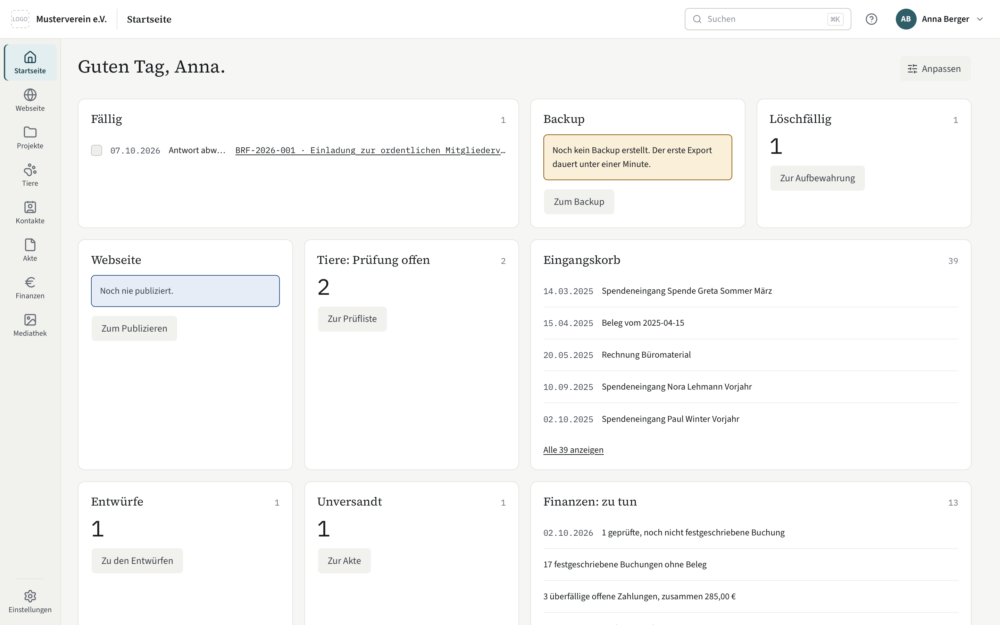

## Worum es geht

Ein gemeinnütziger Verein schuldet Rechenschaft: dem Finanzamt, dem Registergericht, dem Transparenzregister, den Mitgliedern und Spendern. Kompass ist der Ort, an dem jeder Vorgang genau einmal entsteht und bleibt — und aus dem alles erzeugt wird, was der Verein nach außen geben muss: Briefe, Protokolle, Zuwendungsbestätigungen, die öffentliche Webseite, ab 0.3.0 auch Jahresabschluss und Kassenprüfungsunterlagen.

Der Grundsatz dahinter: **ein Vorgang, eine Quelle.** Nichts wird abgetippt, kopiert oder nachträglich einsortiert. Jede Änderung steht im Änderungsprotokoll; Rechenschaftsrelevantes wird storniert, nie gelöscht.

Der Kern ist generisch und für jeden Verein gleich. Was ein Verein braucht und ein anderer nicht, ist ein Modul, das sich je Installation ein- und ausschalten lässt. Kompass entsteht für die [Aluna Tierhilfe e.V.](https://aluna-tierhilfe.org) und läuft dort im Alltag — gebaut ist es für jeden Verein.

Alle Bilder auf dieser Seite zeigen den „Musterverein e.V.“ mit erfundenen Beispieldaten.

## Ein Rundgang

### Startseite

Wer sich anmeldet, sieht, was ansteht: fällige Wiedervorlagen, neue Post im Eingangskorb, Entwürfe und Unversandtes, Tierprofile, die auf Prüfung warten, Löschfristen, das letzte Backup und die Arbeitsliste der Finanzen. Jede Person stellt sich ihre Kacheln selbst zusammen; Kacheln zu Modulen, für die sie kein Recht hat, erscheinen nicht.

### Akte — Schriftverkehr mit Nummer und Ordner

Die Akte nimmt eingehende Post auf und erzeugt ausgehende. Eingescannte Briefe landen im Eingangskorb, werden per Texterkennung durchsuchbar und von Regeln einsortiert. Ordner pflegt man direkt im Baum — anlegen, umbenennen, per Ziehen oder Tastatur verschieben, jede Änderung zehn Sekunden lang rückgängig.

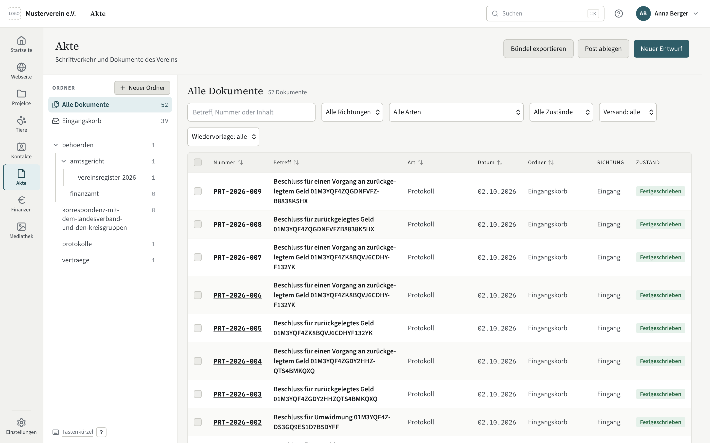

Ein Brief entsteht als Entwurf in Markdown, mit Textbausteinen und einer Vorschau, die beim Tippen mitläuft. Beim Festschreiben bekommt er eine Nummer aus dem Nummernkreis seiner Dokumentart und ist ab dann unveränderlich — korrigiert wird durch Storno und Ersatz, nie durch Überschreiben. „Antworten“ und „Folgeschreiben“ übernehmen Empfänger, Ordner und Bezug.

<table>
  <tr>
    <td>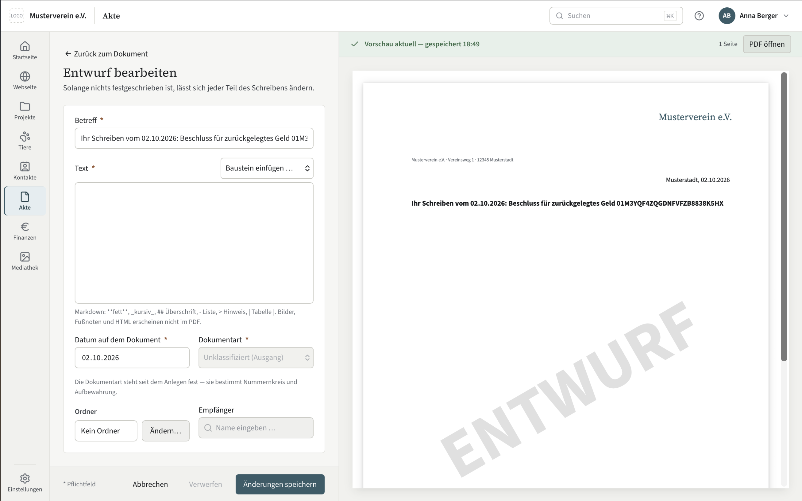</td>
    <td>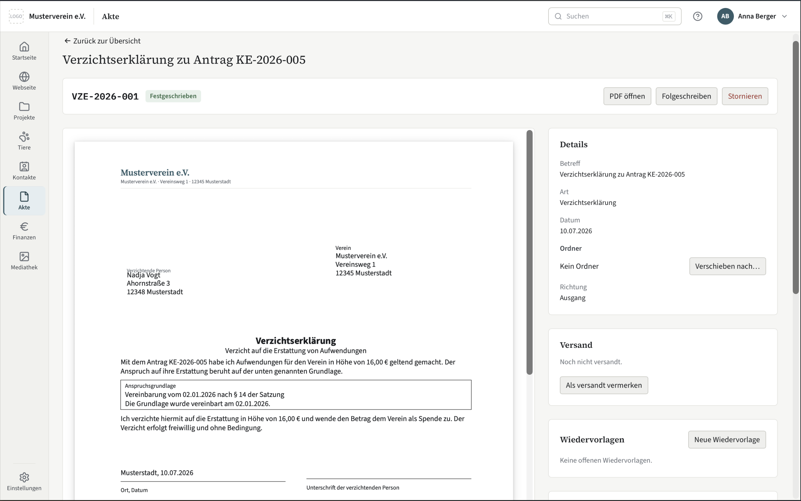</td>
  </tr>
  <tr>
    <td>Entwurf mit Vorschau</td>
    <td>Festgeschrieben: Nummer, Versand, Wiedervorlage, Storno</td>
  </tr>
</table>

### Finanzen — für Vereine mit Einnahmen-Überschuss-Rechnung

Kontoauszüge kommen als CAMT oder CSV herein, Belege aus der Akte, Rechnungen mit eingebettetem ZUGFeRD werden gelesen. Gebucht und festgeschrieben wird nach festen Regeln, Zuwendungsbestätigungen entstehen nach amtlichem Muster — einzeln oder im Serienlauf, auf Wunsch maschinell mit hinterlegter Unterschrift. Auslagen reicht eine Person ein, eine zweite gibt sie frei; die eigenen stehen nie in der eigenen Liste.

<table>
  <tr>
    <td>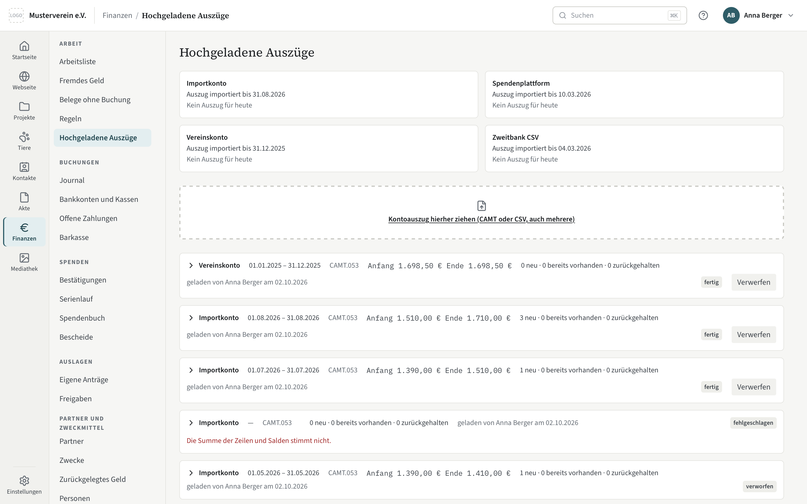</td>
    <td>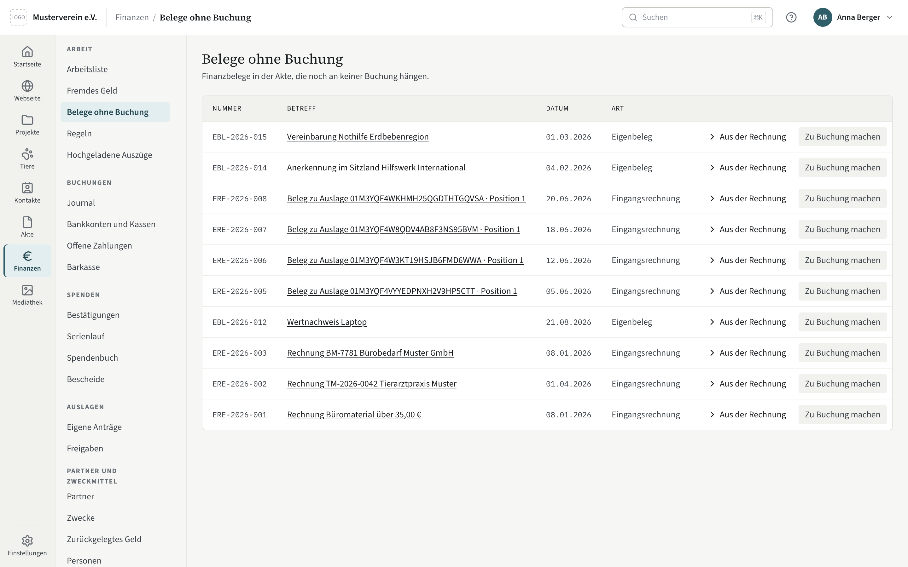</td>
  </tr>
  <tr>
    <td>Kontoauszüge mit Saldenprüfung</td>
    <td>Belege ohne Buchung</td>
  </tr>
  <tr>
    <td>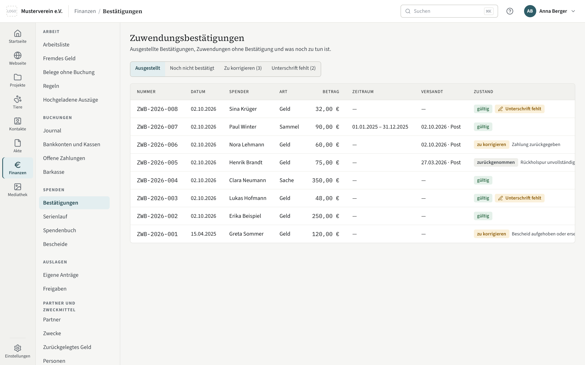</td>
    <td>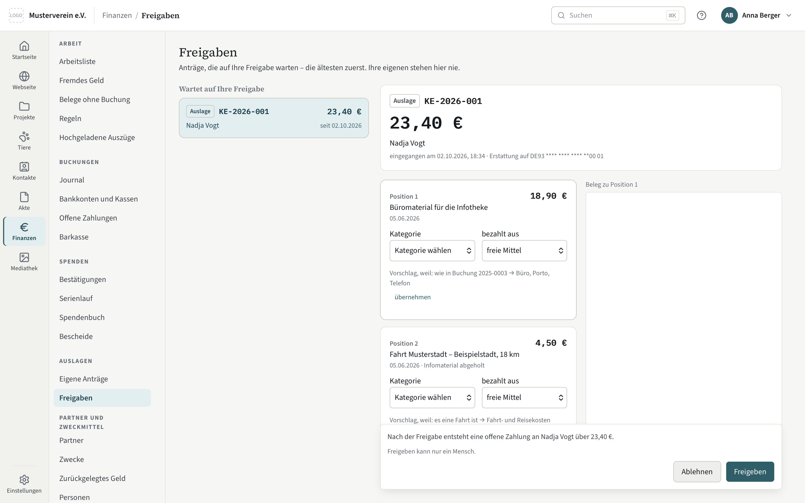</td>
  </tr>
  <tr>
    <td>Zuwendungsbestätigungen</td>
    <td>Auslagen: Freigabe durch eine zweite Person</td>
  </tr>
  <tr>
    <td>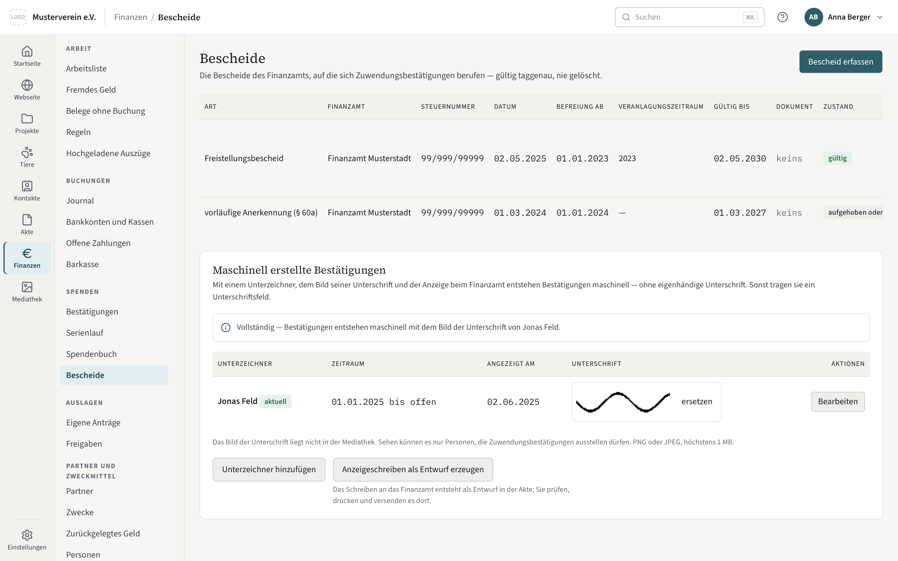</td>
    <td></td>
  </tr>
  <tr>
    <td>Bescheide des Finanzamts und maschinelle Bestätigung</td>
    <td></td>
  </tr>
</table>

Jahresabschluss und Berichte folgen mit 0.3.0. Nicht vorgesehen sind Bilanzierung und die Übermittlung ans Finanzamt.

### Webseite — kein CMS im Internet

Die meisten Vereinsseiten laufen auf einem CMS wie WordPress: ein Programm mit Datenbank, Anmeldung und Plugins, das rund um die Uhr im Internet steht. Jede Lücke darin ist für jeden erreichbar, und Angreifer suchen sie automatisch — sie fragen nicht, wie klein der Verein ist. Wer eine solche Seite sicher halten will, muss ständig Updates einspielen, Plugins prüfen und Warnungen lesen. Das schafft ein ehrenamtlicher Vorstand kaum.

Kompass macht es anders: Die Seite wird **in Kompass gepflegt** und als **fertige Dateien** veröffentlicht — HTML, Bilder, CSS. Auf dem Webspace liegt nur das. Daraus folgt:

- **Kein Login im Netz.** Es gibt keine Anmeldeseite, an der jemand Passwörter durchprobieren könnte.
- **Kein Programm, das man angreifen kann.** Auf dem Webspace läuft nichts, also gibt es keine Lücke, die man ausnutzen könnte, und kein Plugin, das veraltet.
- **Nichts zu aktualisieren.** Fertige Dateien werden nicht alt und brauchen keine Sicherheitsupdates.
- **Ein Angriff auf den Webspace trifft nur die Webseite.** Wer dort einbricht, findet die öffentlichen Seiten — sonst nichts. Kompass selbst steht im eigenen Netz und ist von außen nicht erreichbar.
- **Wiederherstellen ist einfach.** Ein neuer Publish schreibt die Seite komplett neu.

Vor dem Hochladen prüft Kompass auf Sperrwörter und Übersetzungslücken, baut eine Vorschau und zeigt, was sich gegenüber der Live-Seite ändert. Veröffentlicht wird erst, wenn man es bestätigt; jeder Publish steht im Änderungsprotokoll.

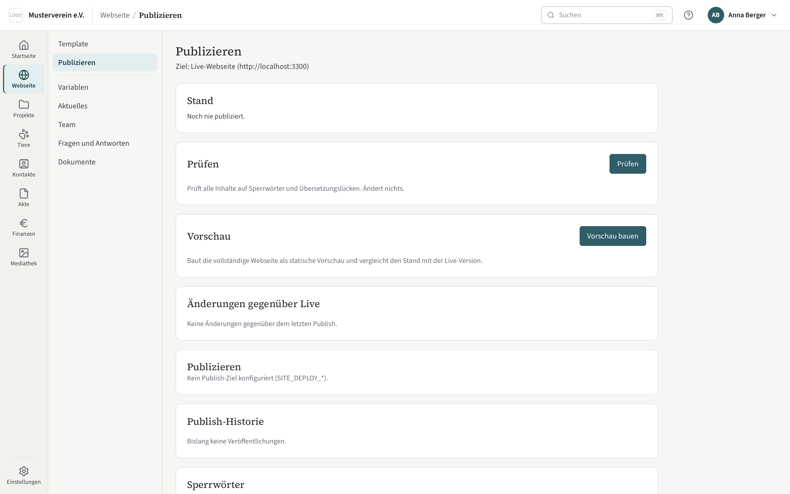

**So sieht das Ergebnis aus:** [aluna-tierhilfe.org](https://aluna-tierhilfe.org) ist die Seite der Aluna Tierhilfe, vollständig aus Kompass gebaut — mit eigenem Template, Hundeprofilen aus dem Tiermodul und Projekten.

Gebaut wird die Seite mit [Astro](https://astro.build), einem Werkzeug, das aus Vorlagen und Inhalten fertige HTML-Dateien erzeugt. Das **Template** ist ein gewöhnliches Astro-Projekt, das der Verein selbst mitbringt — Layout, Farben, Seitenaufbau gehören ihm. Eine Datei `kompass.template.ts` darin sagt Kompass, welche Inhalte das Template braucht: Variablen wie ein Claim oder ein Titelbild, Sammlungen wie „Aktuelles“ oder „Team“ mit ihren Feldern. Kompass erzeugt daraus die Pflegemasken, der Verein füllt sie, Astro baut die Seite. Wer kein eigenes Template hat, startet mit dem mitgelieferten [`templates/verein-basis`](templates/verein-basis). Wie man ein Template schreibt: [`docs/handbuch/webseite/template-schreiben.md`](docs/handbuch/webseite/template-schreiben.md).

### Dokumente — Briefbogen und Formulare aus Vorlagen

Briefe, Zuwendungsbestätigungen, Verzichtserklärungen, Kassenzählungen und Auszüge des Änderungsprotokolls entstehen als PDF. Der Text kommt aus der Akte oder aus der Vorlage des Moduls, das Aussehen aus einer **Basis-Vorlage**: Briefbogen mit Logo und Absender, Ränder, Schrift, Fußzeile, bei Formularen das Anschriftfeld für den Fensterumschlag nach DIN 5008. Gesetzt wird mit [Typst](https://typst.app), einem Satzsystem, das reproduzierbar und schnell PDFs erzeugt — dasselbe Dokument ergibt heute und in zehn Jahren dieselbe Datei.

Kompass bringt generische Basen mit (`a4-mit-briefkopf`, `a4-formular`, `a4-plain` und weitere). Ein Verein legt eigene `.typ`-Dateien daneben und ersetzt damit Kopf und Fuß, nie den Wortlaut eines Formulars — der steht in der Vorlage des Moduls und folgt dem amtlichen Muster. Welche Basis für welche Dokumentart gilt, stellt man unter Einstellungen → Dokumentvorlagen ein. Mehr: [`docs/handbuch/einstellungen/dokumente.md`](docs/handbuch/einstellungen/dokumente.md) und der Abschnitt „Dokument-Basisvorlagen“ in [`betrieb.md`](docs/handbuch/betrieb.md).

### Rechenschaft und Verwaltung

Rechte vergibt man je Rolle, Rollennamen sind frei — „Schatzmeisterin“, „Kassenprüfer“, „Finanz-Agent“. Jede Änderung, ob in der Oberfläche, über MCP oder vom System, steht im Änderungsprotokoll und lässt sich als PDF ausziehen. Löschfristen nach Abgabenordnung und DSGVO rechnet Kompass je Datensatz aus und meldet, was fällig ist.

<table>
  <tr>
    <td>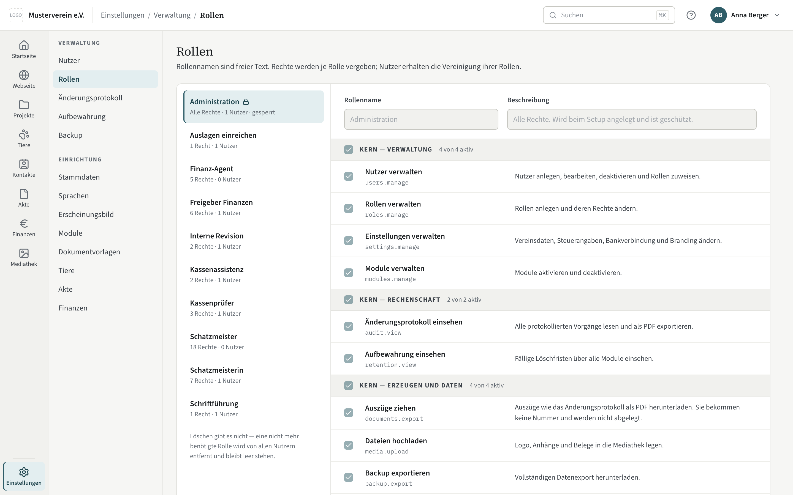</td>
    <td>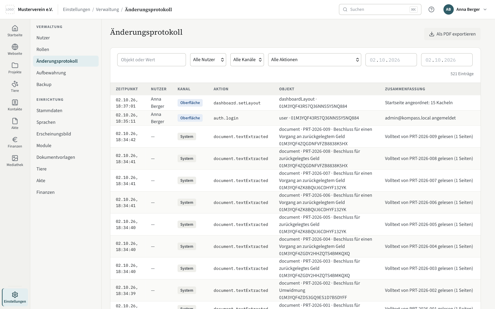</td>
  </tr>
  <tr>
    <td>Rollen und Rechte</td>
    <td>Änderungsprotokoll</td>
  </tr>
  <tr>
    <td>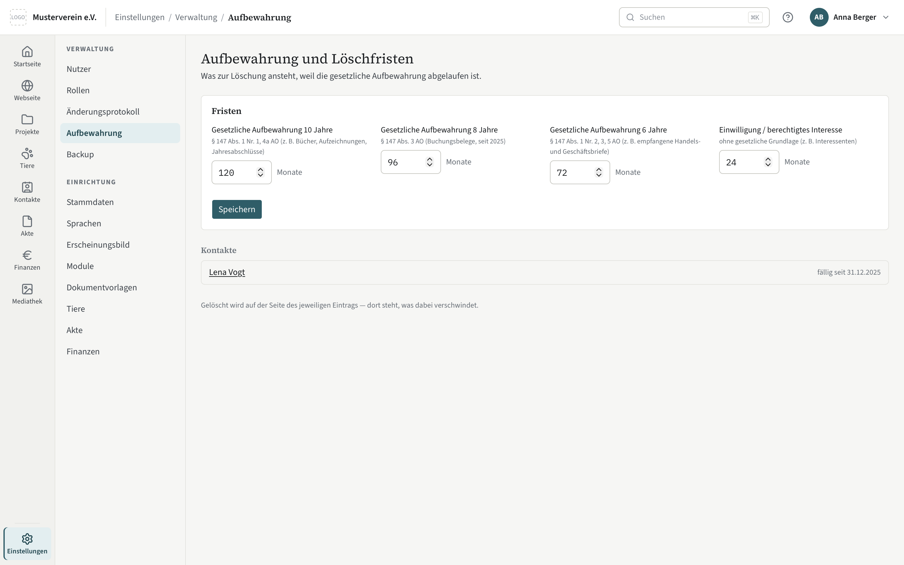</td>
    <td>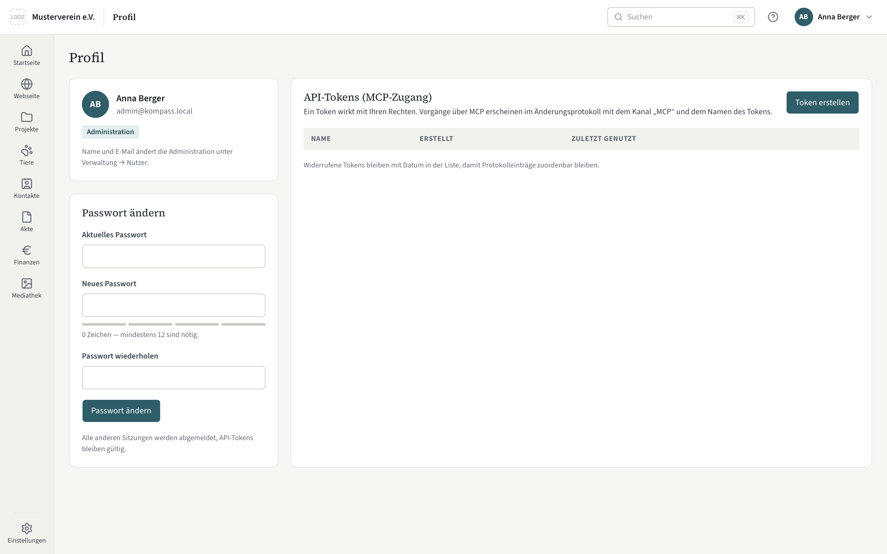</td>
  </tr>
  <tr>
    <td>Aufbewahrung und Löschfristen</td>
    <td>API-Tokens für KI-Assistenten (MCP)</td>
  </tr>
  <tr>
    <td>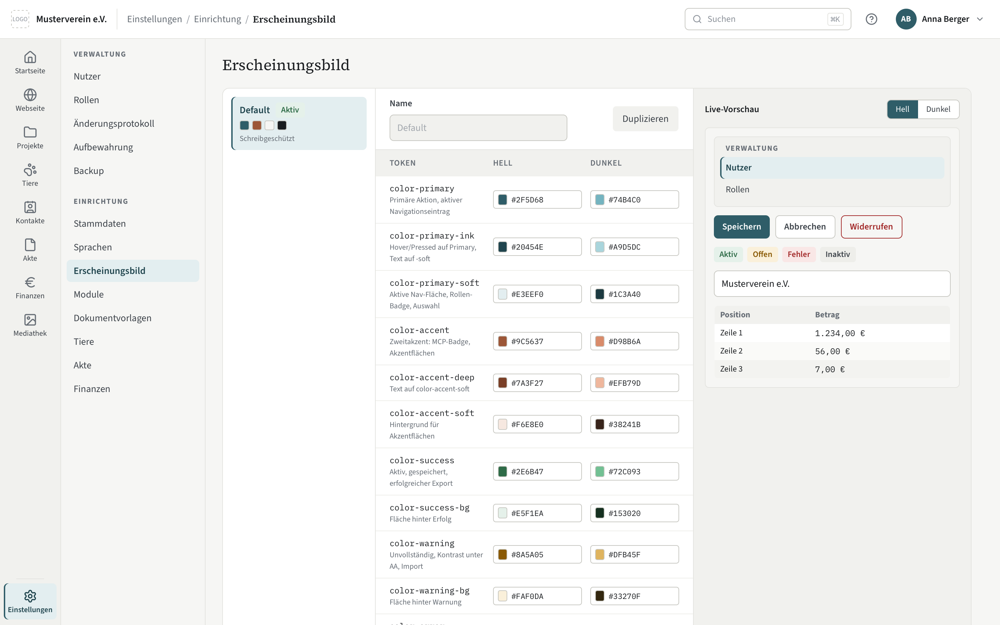</td>
    <td>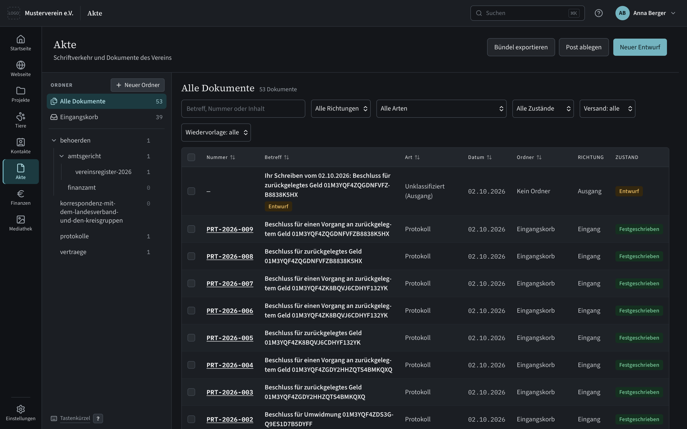</td>
  </tr>
  <tr>
    <td>Erscheinungsbild in den Farben des Vereins</td>
    <td>Dunkler Modus</td>
  </tr>
</table>

### KI-Assistenten über MCP

Was die Oberfläche kann, kann auch ein KI-Assistent über das [Model Context Protocol](https://modelcontextprotocol.io) — dieselben Dienste, dieselben Rechte, dasselbe Protokoll. Ein Token wirkt mit den Rechten der Person, die es erstellt hat; jeder Vorgang steht mit dem Kanal „MCP“ und dem Namen des Tokens im Änderungsprotokoll. Vier Dinge bewusst nicht: Backup ein- und ausspielen, Dateien abrufen, API-Token verwalten, das eigene Passwort ändern. In den Finanzen bleiben Festschreiben, Freigeben und Ausstellen Menschen vorbehalten, solange der Verein es nicht ausdrücklich erlaubt. Ein Test hält die Liste vollständig.

## Was heute da ist

| Bereich | Inhalt |
|---|---|
| **Fundament** | Nutzer, Rollen und Rechte, Einstellungen statt Konstanten, Themes mit hellem und dunklem Modus, Änderungsprotokoll, Aufbewahrung und Löschfristen, Backup und Import, Modul-System, Dokument-Pipeline mit Basis-Vorlagen, Mediathek mit Ordnern |
| **Webseite** | Pflege in Kompass, Bau mit Astro aus dem Template des Vereins, Prüfung auf Sperrwörter und Übersetzungslücken, Vorschau mit Vergleich zur Live-Seite, Publish per rsync auf einen gewöhnlichen Webspace |
| **Kontakte und Akte** | Kontakte mit Rollen über die Zeit und berechneter Aufbewahrungsfrist. Die Akte für ein- und ausgehende Post: Entwurf, Festschreiben, Nummer, Storno statt Löschen, Ordnerbaum, Bezüge, Antworten und Folgeschreiben, Wiedervorlage, Volltext mit Texterkennung |
| **Finanzen** | Bankkonten und Kassen, Kontoauszüge (CAMT, CSV), Belege mit ZUGFeRD, Buchen und Festschreiben, Zuwendungsbestätigungen nach amtlichem Muster mit Serienlauf und Spendenbuch, maschinelle Bestätigungen, Auslagen mit Freigabe durch eine zweite Person, Aufwandsspenden, Zahlungen an Partner mit Nachweisen, Zwecke und Rücklagen, Pauschalen je Person. Für Vereine mit Einnahmen-Überschuss-Rechnung |
| **Projekte, Tiere** | Vereinsspezifische Module mit ihrem öffentlichen Teil für die Webseite; Projekte haben dazu ihren Finanzabschnitt, Tierprofile eine Prüfung vor der Veröffentlichung |
| **MCP** | Alle Dienste der Oberfläche für KI-Assistenten, mit denselben Rechten und demselben Protokoll |

Was als Nächstes kommt — Jahresabschluss und Berichte der Finanzen, Mitglieder und Gremien, das Tiermodul in seiner Vollstufe — und warum in dieser Reihenfolge, steht in [`docs/nordstern.md`](docs/nordstern.md). Dort steht auch, was Kompass **nicht** ist: kein Newsletter, kein Mailprogramm, kein Kalender, kein Aufgabenmanager, keine Finanzbuchhaltung für Bilanzierer und keine Übermittlung ans Finanzamt, kein Webseiten-Baukasten, kein Multi-Tenant.

## Betrieb

Kompass läuft als ein Docker-Image auf dem NAS oder Server des Vereins, mit Dev, Test und Prod strikt getrennt. Voraussetzungen, Installation, Update, Backup und Webseiten-Publish: [`docs/handbuch/betrieb.md`](docs/handbuch/betrieb.md). Das vollständige Handbuch liegt unter [`docs/handbuch/`](docs/handbuch/inhalt.md) und ist in der App über das „?“ in der Kopfleiste erreichbar.

## Entwicklung

Voraussetzungen: Node 24 oder neuer, pnpm 11, Docker für die vollständige Prüfung. Für die Texterkennung und das Lesen eingebetteter Rechnungen lokal `tesseract`, `tesseract-lang` und `poppler`.

```bash
pnpm install
cp apps/kompass/.env.example apps/kompass/.env   # SESSION_SECRET setzen
pnpm dev                                          # http://localhost:3000, Einrichtung beim ersten Aufruf
pnpm seed                                         # erfundene Beispieldaten für Kern und alle Module
```

Prüfen, bevor etwas gepusht wird:

```bash
pnpm typecheck
pnpm test
pnpm verify        # Typecheck, alle Tests, E2E kalt, Image-Build, E2E gegen das Image (~15 min, braucht Docker)
```

Aufbau des Repos:

```
apps/kompass/          Next.js-Anwendung: Oberfläche, MCP-Endpunkt, E2E-Tests
packages/core/         Kern: Dienste, Datenbank, Rechte, Änderungsprotokoll, Modul-System
packages/modules/      Fachmodule: animals, contacts, dms, finance, projects, site
packages/documents/    Dokument-Pipeline (Markdown → Typst → PDF)
packages/markdown/     Markdown für Dokumente, Webseite und Handbuch (Rendern, Bereinigen, Typst)
packages/text-extraction/ Texterkennung und eingebettete Dateien aus PDFs (OCR, ZUGFeRD)
packages/mcp/          MCP-Server über den Kerndiensten
packages/site-template/ Vertrag zwischen Kompass und einem Webseiten-Template
templates/verein-basis/ Mitgeliefertes Basis-Template für die Vereinsseite
docs/                  Nordstern, Betrieb, Backlog, Hilfeseiten
```

Regeln, Prinzipien und alle Befehle: [`AGENTS.md`](AGENTS.md). Die neun Prinzipien dort — generischer Kern, Konfiguration statt Konstanten, nichts Rechenschaftsrelevantes wird gelöscht, ein Weg zu den Daten, TDD ab der ersten Zeile — gelten für jeden Beitrag.

## Fragen, Fehler und Sicherheit

- **Fragen und Fehler** gehören in ein [Issue](https://github.com/DigiJoe79/Aluna-Kompass/issues).
  Hilfreich: welche Fassung (Fuß der Seitenleiste oder `/api/health`) und was du erwartet hast.
- **Sicherheitslücken** bitte **nicht** als Issue, sondern über den privaten
  Meldekanal — der Weg steht in [`SECURITY.md`](SECURITY.md).
- **Quellcode der mitgelieferten Fremdsoftware** (GPL/LGPL): ein Issue genügt.
  Die Aufstellung steht in [`THIRD-PARTY-NOTICES.md`](THIRD-PARTY-NOTICES.md).
- **Mitarbeiten**: [`CONTRIBUTING.md`](CONTRIBUTING.md) — was man zuerst wissen
  muss; die Regeln selbst stehen in [`AGENTS.md`](AGENTS.md).

## Lizenz

Apache-2.0 — siehe [`LICENSE`](LICENSE) und [`NOTICE`](NOTICE).

Die Lizenz erlaubt Nutzung, Änderung und Weitergabe, auch kommerziell.
Sie gewährt ausdrücklich Patentrechte (§ 3), verlangt einen Hinweis auf
geänderte Dateien (§ 4b) und räumt keine Rechte am Namen „Aluna Kompass“
ein (§ 6).
