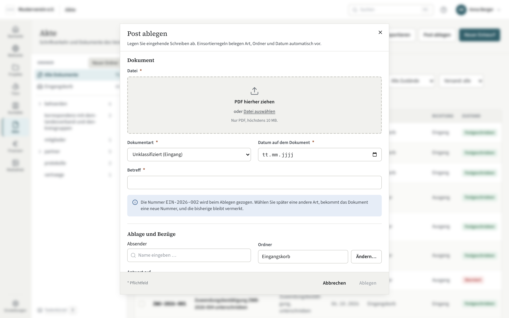

# Post ablegen

Eingehende Post kommt als PDF in die Akte: Ziehen Sie die Datei auf einen
Ordner der Ordnerspalte oder auf den Eingangskorb, bestätigen Sie Art, Betreff und
Absender — und das Dokument hat seine Nummer, seinen Ordner und seine
Aufbewahrungsfrist. Was Sie nicht sofort einsortieren, wartet im Eingangskorb.

## Die Ablage

Die Ordnerspalte links ist nicht nur ein Filter, sondern das Ziel: Während
Sie eine Datei über das Fenster ziehen, hebt sich jede Zeile als Ablagefläche
hervor. Lassen Sie die Datei auf einem Ordner los, öffnet sich der Dialog
„Post ablegen“ mit diesem Ordner. Lassen Sie sie auf „Eingangskorb“ los, landet
sie ohne Ordner im Eingangskorb. Mehrere PDFs auf einmal werden nacheinander
abgefragt; Dateien, die kein PDF sind, nennt Kompass beim Namen („… ist kein PDF und
wurde nicht übernommen“); sie werden nicht abgelegt und bleiben dort liegen,
wo sie sind. Auf dem Telefon gibt es kein Ziehen; dort nehmen Sie „Post
ablegen“.

Ohne Drag-and-drop: „Post ablegen“ oben in der Liste öffnet denselben Dialog
mit einer Dateiauswahl.

## Der Dialog

- **Dokumentart** — Brief, Behördenschreiben, Vertrag, Rechnung, Protokoll
  oder was Sie unter Einstellungen → Akte angelegt haben. Die Art
  bestimmt Nummernkreis und Aufbewahrungsfrist.
- **Betreff** — kurz, wie im Briefkopf; danach wird gesucht.
- **Absender** — ein Kontakt. Fehlt er, legen Sie ihn aus dem Dialog heraus
  an.
- **Datum auf dem Dokument** — das Datum des Schreibens, nicht der Ablage.
- **Ordner** — vorbelegt aus dem Ziel, auf dem Sie die Datei losgelassen
  haben. Mit „Ändern…“ öffnet sich „Ordner wählen“ mit dem Ordnerbaum; Sie
  wählen den Ordner und übernehmen ihn.

Die **Einsortierhilfe** schlägt Art und Ordner vor, sobald der Text der
Datei gelesen ist: nach den Regeln, die Sie unter Einstellungen → Akte festgelegt
haben (etwa „Absender Finanzamt → Behördenschreiben, Ordner Steuern“). Ein
Vorschlag ist ein Vorschlag; Sie bestätigen oder ändern ihn.

## Der Eingangskorb

Der Eingangskorb sammelt, was noch keinen Ordner hat. Von dort ziehen Sie ein
Dokument später auf seinen Ordner, kreuzen mehrere an und wählen „Verschieben
nach…“ oder öffnen es und verschieben es auf der Detailseite. Ein Dokument im Eingangskorb ist bereits abgelegt und nummeriert —
es ist nur noch nicht einsortiert.

## Angaben nachträglich ändern

Art, Betreff oder Datum eines abgelegten Eingangs lassen sich auf der
Detailseite unter **„Angaben ändern“** berichtigen — etwa wenn Sie eine neue
Dokumentart angelegt haben, zu der ein schon abgelegtes Schreiben besser passt.
Die Datei bleibt dabei, wie sie ist.

- **Eine andere Art bringt eine neue Nummer** aus deren Präfix, im Jahr der
  Ablage: Aus `VER-2026-004` wird zum Beispiel `BEH-2026-011`. Die bisherige
  Nummer bleibt am Dokument als „Früher: VER-2026-004“ stehen, und die Suche
  findet das Dokument auch unter ihr.
- **Die Aufbewahrung folgt der neuen Art und dem neuen Datum.** Der Dialog
  zeigt vor dem Speichern, wie sich Nummer und Frist ändern.
- Jede Änderung steht im Änderungsprotokoll, mit Art, Nummer, Betreff und
  Datum davor und danach.

Das gilt nur für eingehende Post. Die Nummer eines ausgehenden Dokuments steht
in dem PDF, das verschickt wurde; dort bleibt der Weg Storno mit Ersatz. Ein
storniertes Dokument lässt sich nicht mehr ändern.

## Danach

Kompass liest den Text jedes PDFs im Hintergrund; hat eine Seite keinen Text,
erkennt die Texterkennung ihn. Sobald das geschehen ist, findet die Suche das
Dokument über seinen Inhalt — siehe [Volltext](volltext.md). Ein Dokument
antwortet auf ein anderes oder ersetzt es: [Bezüge und
Wiedervorlage](bezuege-und-wiedervorlage.md).
