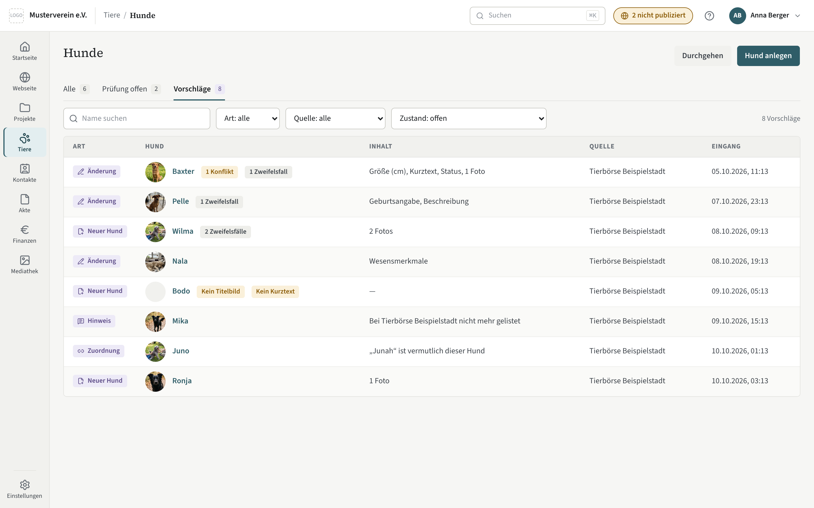
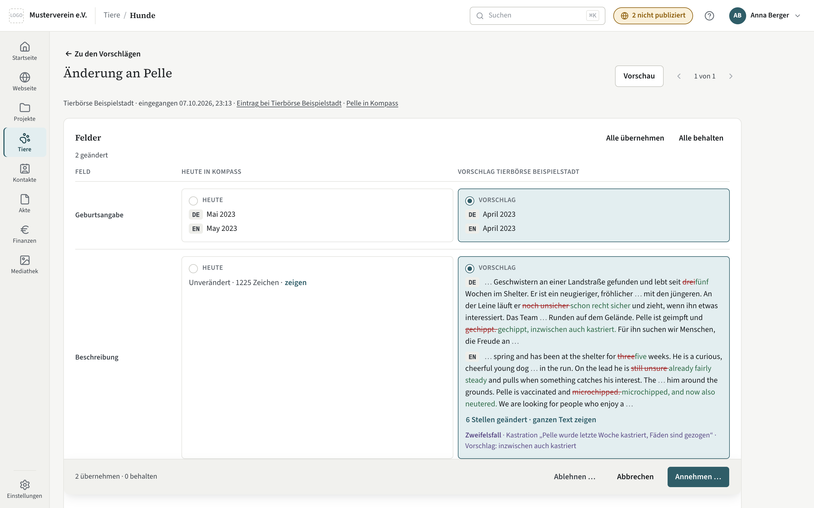
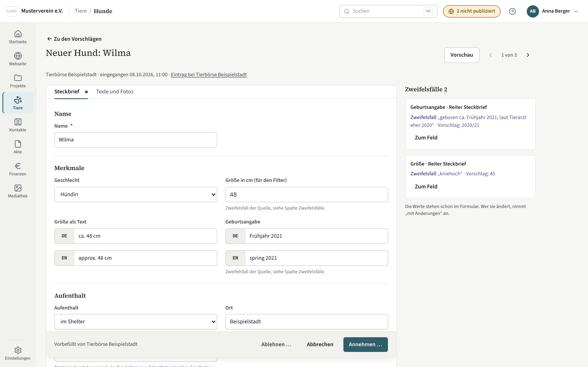
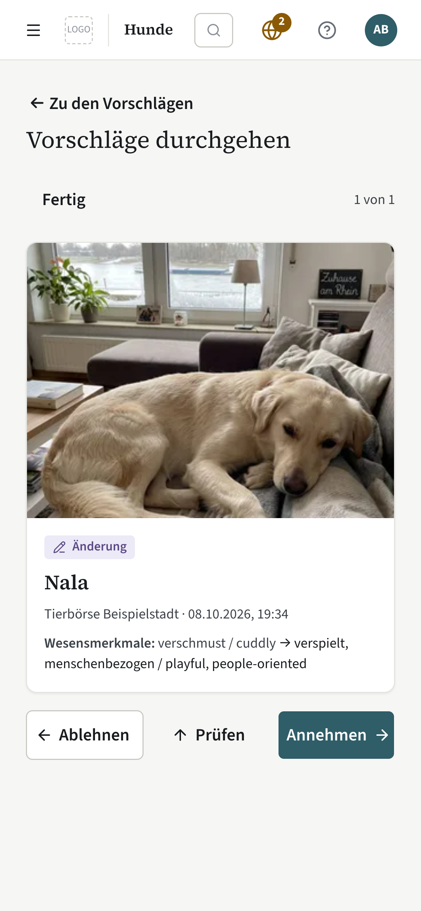

# Vorschläge prüfen

Eine Quelle ist ein angebundener Dienst mit eigenem Zugang — etwa die Datenbank
eines Partnertierheims —, der Hunde nur vorschlagen darf. Was sie vorschlägt,
ändert nichts am Bestand, bis ein Mensch es annimmt. Hier steht, wo Vorschläge
erscheinen, wie Sie sie prüfen und was die Quelle davon erfährt.

## Wo Vorschläge erscheinen

- **Reiter „Vorschläge“** in der [Tierliste](tiere.md), mit der Zahl aller
  offenen Vorschläge. Er führt auf eine eigene Liste mit eigenen Filtern (Art,
  Quelle, Zustand); die Filter der Tierliste reisen nicht mit.
- **Kachel „Vorschläge offen“** auf der [Startseite](startseite.md): Zahl, Alter
  des ältesten und wie viele davon einen Konflikt haben.
- **Marke „Vorschlag“** an einem Hund in der Tierliste, solange ein Vorschlag zu
  ihm offen ist.
- **Band „Offener Vorschlag von …“** im Profil des Hundes, mit dem Weg zur
  Prüfung.

Die Liste zeigt zuerst, was am längsten wartet. Über den Filter „Zustand“
sehen Sie auch Entschiedenes: wer wann entschieden hat und mit welchem Grund.
Nach 90 Tagen löscht Kompass die Werte und Fotos entschiedener Vorschläge;
Zustand und Grund bleiben.

## Die vier Arten

- **Neuer Hund** — ein Hund, den es in Kompass noch nicht gibt.
- **Änderung** — neue Werte oder Fotos für einen Hund, den es schon gibt.
- **Hinweis** — die Quelle meldet etwas, etwa „nicht mehr gelistet“.
- **Zuordnung** — die Quelle fragt, ob ein Hund bei ihr derselbe ist wie einer
  in Kompass.

Zweifel der Quelle an einzelnen Angaben heißen **Zweifelsfall**: das Feld, ein
Zitat aus ihrer Quelle und, wenn sie einen hat, ihr Vorschlag. Die Zeile steht
im Violett der Quelle und beginnt immer mit „Zweifelsfall“; ein violetter Punkt
am Reiter zeigt, wo einer steht.

## Eine Änderung prüfen

Je geändertem Feld stehen zwei Flächen nebeneinander, „Heute“ und „Vorschlag“;
Sie wählen eine Seite. Vorgewählt ist der Vorschlag. Lange Texte zeigen den
Vorschlag als Unterschied zum heutigen Text: gestrichen, was wegfällt,
hervorgehoben, was dazukommt. Gezeigt werden nur die geänderten Stellen mit
etwas Text drumherum; „6 Stellen geändert · ganzen Text zeigen“ (gezählt über
alle Sprachen) klappt den ganzen Text auf.

**Konflikt:** Hat jemand ein Feld in Kompass geändert, nachdem die Quelle es
vorgeschlagen hat, trägt es die Marke „Konflikt“. Darunter steht, wer es wann
geändert hat, und der Stand beim Vorschlag. Dort ist „Heute“ vorgewählt —
wer den Vorschlag will, wählt ihn bewusst.

**Fotos** stehen in der Reihenfolge danach, mit den Marken „neu“, „bleibt“ und
„fällt weg“. Neue Fotos übernehmen Sie mit dem Haken „übernehmen“; Fotos aus
Kompass bleiben, solange Sie sie nicht abwählen. Wechselt das Titelbild, ist
das eine eigene Wahl. Einen Ausschnitt der Quelle zeigt das Foto als helles
Rechteck, außen abgedunkelt; die Webseite nutzt ihn noch nicht.

„Zu den Vorschlägen“ führt zurück in die Liste, „1 von 7“ im Kopf blättert
durch dieselbe Auswahl.

## Einen neuen Hund prüfen

Die Prüfseite ist dieselbe Maske wie „Hund anlegen“, mit den Werten der Quelle
vorbefüllt. Die Zweifelsfälle stehen in einer Spalte daneben; „Zum Feld“
wechselt auf den Reiter und setzt den Cursor ins Feld. Was Sie ändern, gilt
beim Annehmen. Fotos lassen sich als Titelbild wählen, umsortieren und
weglassen. Gibt es schon einen Hund gleichen Namens, nennt die Seite ihn mit
Link — ist es derselbe, bitten Sie die Quelle um eine Zuordnung oder lehnen ab.

## Annehmen und Ablehnen

**Annehmen …** fasst zusammen, was übernommen und was behalten wird, und sagt,
wie die Quelle es zurückbekommt: „angenommen“ oder, wenn Sie etwas anders
gewählt haben, „angenommen mit Änderungen“. Wird ein Hund dabei „vermittelt“,
fragt der Dialog nach dem Vermittlungsjahr. Mit „Wiedervorlage anlegen“
entsteht am Hund eine [Wiedervorlage](akte/bezuege-und-wiedervorlage.md) mit Datum und Notiz.
Bei einem neuen Hund ist „Veröffentlichen“ vorgewählt: Er erscheint mit dem
nächsten Publizieren der Webseite. Neue Fotos gehen in die
[Mediathek](mediathek.md).

**Ablehnen …** fragt nach einem Grund (freiwillig); die Quelle bekommt ihn
zurück. Am Hund ändert sich nichts, die Fotos des Vorschlags werden gelöscht.

Danach geht es zum nächsten offenen Vorschlag, am Ende zurück in die Liste.

## Hinweis „nicht mehr gelistet“

Meist heißt das: vermittelt. Die Hauptaktion **„Vermittelt · offline ·
erledigt“** setzt den Status auf „Vermittelt“, nimmt den Hund von der Webseite
und nimmt den Hinweis zur Kenntnis, in einem Schritt. Was schon erledigt ist
(etwa schon offline), fällt aus der Aktion heraus. Danach steht fünf Sekunden
lang „Rückgängig“ im Hinweis unten; erst dann geht die Entscheidung ab.

Für einen anderen Grund — etwa verstorben — gibt es die Einzelschritte „Status
ändern …“ und „Von der Webseite nehmen“; der Hinweis bleibt dann offen, bis Sie
„Nur zur Kenntnis nehmen“ wählen.

## Zuordnung

Zwei Spalten, links der Hund der Quelle, rechts der in Kompass; abweichende
Werte sind gelb hinterlegt. **„Gleicher Hund“** verknüpft beide: Künftige
Änderungen der Quelle kommen dann als Änderung an diesem Hund. **„Anderer
Hund“** sagt der Quelle, dass es nicht derselbe ist.

## Durchgehen

Den Stapel gibt es nur, wenn er unter [Einstellungen → Tiere](einstellungen/tiere-einrichten.md)
eingeschaltet ist (Vorgabe: aus). Dann zeigt „Durchgehen“ in der Liste dieselbe
Auswahl als Kartenstapel: rechts
annehmen, links ablehnen (ohne Grund), hoch prüfen; am Rechner mit den
Pfeiltasten ← ↑ →; dieselben drei Wege stehen als Knöpfe unter der Karte. Das
Foto zeigt das Titelbild im Bildausschnitt der Webseite, mit dem Ausschnitt der
Quelle, wenn sie einen mitschickt. Rechts nimmt mit der Vorauswahl an; ein
vollständiger neuer Hund geht dabei online, und die Karte sagt das
(„Annehmen stellt den Hund online.“).

Rechts führt stattdessen auf die Prüfseite (Knopf „Prüfen“ mit Pfeil nach rechts), wenn die Karte einen
Konflikt oder Zweifelsfälle hat, ein Hinweis oder eine Zuordnung ist oder einem
neuen Hund das Titelbild oder der Kurztext fehlt — so geht nichts
Unvollständiges mit einem Wisch online. Die Karte nennt den Grund.

Jede Entscheidung bleibt fünf Sekunden zurückgehalten: **„Rückgängig“** heißt,
sie wird gar nicht erst abgeschickt; die Quelle sieht nie eine zurückgenommene
Entscheidung. Wer in diesen fünf Sekunden die Seite schließt, lässt den
Vorschlag offen. Am Ende steht, wie viele angenommen, abgelehnt und offen
gelassen wurden, und wie viele Änderungen noch nicht auf der Webseite sind —
mit dem Weg zum [Publizieren](webseite/publizieren.md).

## Vorschau

„Vorschau“ im Kopf einer Änderung oder eines neuen Hundes baut die Seite des
Hundes aus der Vorlage der Webseite, mit „Heute“ oder „Mit Wahl“, ohne zu
speichern und ohne zu publizieren. Ändert sich die Wahl, baut sie neu. Das geht
nur, wenn die Vorlage eine Seite für einzelne Hunde hat; sonst sagt das
Fenster es.

## Rechte und Einstellungen

Prüfen, annehmen und ablehnen verlangt das Recht „Tiere verwalten“; ohne es
gibt es weder den Reiter noch die Kachel. Die Quelle bekommt einen eigenen
Zugang mit den Rechten „Tiere ansehen“ und „Tiere vorschlagen“. Eine Quelle
pausieren Sie, indem Sie ihren Nutzer deaktivieren.

Ob Kompass Vorschläge überhaupt annimmt und in welchen Ordner der Mediathek
ihre Fotos gehen, steht unter
[Einstellungen → Tiere](einstellungen/tiere-einrichten.md). Ist die Einstellung
aus, lehnen die Werkzeuge der Quelle ab; offene Vorschläge bleiben sichtbar, bis
sie abgearbeitet sind.
