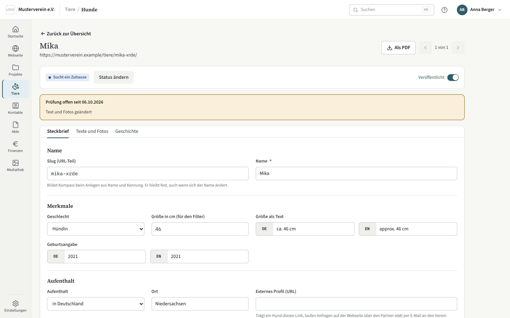

# Tiere

Jedes Tier hat ein Profil: Name, Herkunft, Geschichte, Fotos aus der
Mediathek und die Angaben, die die Webseite zeigt. Das Profil ist der
öffentliche Teil; der ganze Weg eines Tieres von der Aufnahme bis zur
Nachkontrolle kommt mit der Vollstufe des Moduls.

## Die Liste

Je Hund ein Vorschaubild, Name, Status, Kennzeichen, Aufenthalt mit Ort, die
Zahl der Fotos, das Datum der letzten Änderung und ob er auf der Webseite
steht. „Hund anlegen“ öffnet ein neues Profil.

- **Umschalter** — „Alle“ zeigt den ganzen Bestand, „Prüfung offen“ nur die
  Profile, die auf eine Durchsicht warten; die Zahl dahinter gilt immer für
  den ganzen Bestand. In „Prüfung offen“ steht oben, was am längsten wartet.
  Ein wartendes Profil trägt in beiden Ansichten die Marke „Prüfung offen“;
  wer mit der Maus darauf bleibt, liest die Notiz dazu.
- **Filter** — die Namenssuche, der Status, der Aufenthalt und ob der Hund
  veröffentlicht ist. Sie wirken zusammen; die Zeile rechts daneben sagt,
  wie viele Hunde übrig bleiben („17 von 187 Hunden“).
- **Sortierung** — ein Klick auf „Hund“ oder „Geändert“ im Tabellenkopf
  sortiert, ein zweiter dreht die Richtung.

Filter und Sortierung stehen in der Adresse der Seite: Ein Lesezeichen oder
ein weitergegebener Link öffnet dieselbe Auswahl, und der Weg in ein Profil
nimmt sie mit.

## Profile drucken

Wer Dokumente erzeugen darf, sieht in der Liste vor jedem Hund ein Kästchen.
Das Kästchen im Tabellenkopf wählt alle Hunde, die gerade gezeigt werden —
mit Filtern also genau die gefilterte Auswahl, etwa alle veröffentlichten
Hunde, die ein Zuhause suchen. Die Leiste unten nennt die Zahl, „Als PDF“
lädt eine Mappe mit einer Seite je Hund in der Reihenfolge der Liste. Ein
anderer Filter fängt mit einer leeren Auswahl an. Im Profil eines Hundes
gibt es „Als PDF“ für ihn allein.

Jede Seite zeigt das Hauptfoto im Ausschnitt der Webseite, bis zu drei
weitere Fotos, die Angaben als Marken, den Kurztext und darunter den
Langtext. Passt der Langtext nicht, wird er kleiner gesetzt; reicht auch das
nicht, endet er nach dem letzten ganzen Absatz, der noch passt. Bei
veröffentlichten Hunden steht unten ein QR-Code zum Online-Profil, und ein
gekürzter Text verweist darauf. Dafür muss unter Verwaltung → Tiere die
Adresse des Online-Profils eingetragen sein.

## Das Profil

Drei Reiter:

- **Steckbrief** — Name, Geschlecht, Aufenthalt (im Shelter oder in
  Deutschland) mit dem Ort dazu — ein Freitext für Land und Stadt des
  Shelters oder das Bundesland der Pflegestelle, für alle Sprachen gleich —,
  Größe und Geburtsangabe, die Kennzeichen „Notfall“ und
  „Patentier“, und das externe Profil: Trägt ein Hund den Link eines
  Partnervereins, laufen Anfragen auf der Webseite über den Partner, nicht
  über Kompass.
- **Texte und Fotos** — links Kurztext, Beschreibung und Wesensmerkmale, je
  Sprache; rechts die Fotos aus der [Mediathek](mediathek.md), eines davon als
  Hauptfoto. Ein Klick auf ein Foto öffnet das Original in einem neuen Tab.
  Die Fotos stehen im Ausschnitt, in dem die Webseite das Hauptfoto zeigt;
  eingestellt wird er unter [Einstellungen → Tiere](einstellungen/tiere-einrichten.md).
  Texte und Fotos werden zusammen mit „Speichern“ unten gespeichert; einen
  eigenen Knopf für die Fotos gibt es nicht. Bei einem neuen Hund lassen sich
  Fotos wählen, sobald er angelegt ist. Ein Tier hat höchstens 12 Fotos; neben
  „Fotos wählen“ steht, wie viele davon belegt sind („10 von 12 Fotos“). Ist
  die Grenze erreicht, lässt der Auswahldialog kein weiteres Foto zu — heben
  Sie dort erst eines auf oder nehmen Sie eines heraus.
- **Geschichte** — erst nach der Vermittlung: Vorher- und Nachher-Bild mit
  Unterschrift, ein Zitat der Familie, das Vermittlungsjahr. Daraus macht das
  Template die „Glücklichen Vermittlungen“.

Den URL-Teil (Slug) bildet Kompass beim Anlegen selbst: der Name, ein
Bindestrich und eine kurze Kennung, etwa `luna-7k3f`. Er bleibt danach fest,
auch wenn sich der Name ändert. So zeigen geteilte Links und gedruckte
QR-Codes immer auf denselben Hund, und zwei Hunde dürfen gleich heißen. In
der Maske steht er zum Kopieren, ändern lässt er sich nicht.

**Speichern heißt speichern.** Die Leiste unten gilt für alle drei Reiter: Sie
zählt, was auf irgendeinem von ihnen geändert wurde, und „Speichern“ schreibt
alles auf einmal, egal auf welchem Reiter Sie gerade stehen. Das gilt auch für
den Schalter „Veröffentlicht“ oben im Profil: Er zählt als Änderung und wirkt
erst mit dem Speichern. In der Liste dagegen schaltet derselbe Schalter
sofort. Die Ausnahme im Profil ist „Status ändern“: Der Dialog schreibt gleich,
weil der Status bestimmt, ob es eine Geschichte gibt.

Wer ein Profil aus einer gefilterten oder sortierten Liste öffnet, sieht oben
rechts seinen Platz darin, etwa „3 von 17“, mit Pfeilen zum vorherigen und
zum nächsten Hund derselben Auswahl. Der gewählte Reiter bleibt beim Blättern
stehen, und der Rückweg führt in dieselbe Auswahl. In einer solchen Auswahl
gibt es neben „Speichern“ den Knopf „Speichern und weiter“.

## Prüfen

Was ein Agent schreibt, ist ein Vorschlag, bis ein Mensch ihn gesehen hat.
Legt ein Agent über MCP ein Profil an oder ändert er Texte, Fotos, die
Geschichte oder Übersetzungen, merkt Kompass das Profil von selbst zur
Prüfung vor. Die Änderung steht sofort im Profil; der Merker sagt nur, dass
noch niemand draufgeschaut hat. Der Agent kann dazu eine kurze Notiz
hinterlassen, was anzusehen ist, etwa „zwei neue Fotos“. Änderungen in der
Oberfläche, ein Statuswechsel und das Veröffentlichen setzen keinen Merker.

Der Merker steht quer zu „veröffentlicht“, es gibt also vier Fälle:

- **Prüfung offen, nicht veröffentlicht** — ein neues Profil, das auf die
  erste Durchsicht wartet.
- **Prüfung offen, veröffentlicht** — ein Profil, das schon auf der Webseite
  steht und seither geändert wurde. Die Änderung geht mit dem nächsten
  Publish live, geprüft oder nicht.
- **Keine Prüfung offen, nicht veröffentlicht** — zurückgezogen oder noch in
  Arbeit.
- **Keine Prüfung offen, veröffentlicht** — alles in Ordnung.

**Prüfen am Stück:** In der Liste auf „Prüfung offen“ schalten und den ersten
Hund öffnen; oben steht, was am längsten wartet. Über den Reitern steht ein
Band „Prüfung offen seit …“ mit der Notiz. Auf dem Reiter „Texte und Fotos“
die Texte lesen, das Hauptfoto wählen und Fotos herausnehmen, die nicht auf
die Webseite sollen. „Geprüft und weiter“ führt zum nächsten wartenden Hund,
nach dem letzten zurück in die Liste. Außerhalb einer solchen Auswahl heißt
der Knopf „Geprüft“.

**Was „Geprüft“ bewirkt:** Es speichert Texte und Fotos und nimmt den Merker
samt Notiz zurück. Bei einem noch nicht veröffentlichten Hund steht im Band
der Haken „Beim Bestätigen veröffentlichen“; er ist gesetzt, und wer ihn
herausnimmt, bestätigt nur. „Speichern“ daneben speichert, lässt die Prüfung
aber offen.

Bestätigen kann nur ein Mensch in der Oberfläche; über MCP gibt es dafür kein
Werkzeug, ein Agent gibt seinen eigenen Vorschlag nicht frei. Hat der Agent
das Profil geändert, nachdem Sie es geöffnet haben, weist Kompass das
Bestätigen ab: Laden Sie die Seite neu, dann sehen Sie den aktuellen Stand.

Zwei Stellen erinnern an offene Prüfungen: die Kachel „Tiere: Prüfung offen“
auf der [Startseite](startseite.md), die alle wartenden Profile zählt, und
die Befundzeile „Prüfung offen“ beim [Publizieren](webseite/publizieren.md),
die nur die schon veröffentlichten nennt. Sie warnt, sperrt aber nicht.

## Status

„Status ändern“ setzt Sucht ein Zuhause, Reserviert oder Vermittelt — mit
Vermittlungsjahr. Der Status steuert, wo der Hund auf der Webseite erscheint;
gelöscht wird ein Hund nicht, er wird vermittelt.

## Beziehungsakte

Unten stehen die Dokumente der Akte, die auf dieses Tier zeigen —
Übernahmevereinbarung, Adoptionsvertrag, Tierarztrechnung. Von hier aus legen
Sie neue Post mit dem Bezug an.

## Löschen

Ein Tierprofil ist Webseiteninhalt und lässt sich löschen — etwa ein Hund des
Partnervereins, der ein paar Tage auf der Seite stand und dort vermittelt
wurde. Der Abschnitt „Löschen“ mit dem Knopf „Tierprofil löschen“ steht als
letzte Karte ganz unten auf der Profilseite, nie neben „Speichern“.

Gelöscht wird in zwei Stufen. Ist das Profil veröffentlicht, bietet der Dialog
zuerst „Zurückziehen“ an; erst danach wird „Löschen“ frei. So verschwindet
nichts versehentlich, was gerade auf der Webseite steht.

Hängt noch etwas am Tier — ein Dokument in der Akte, auch ein Entwurf, oder
eine offene Wiedervorlage —, nennt der Dialog es und löscht nicht. Lösen Sie
den Bezug am Dokument oder haken Sie die Wiedervorlage ab, dann geht es.

Fotos, die nur bei diesem Tier verwendet werden, können Sie im selben Schritt
mitlöschen; das Häkchen ist gesetzt. Fotos, die auch anderswo verwendet werden,
bleiben in der Mediathek, und der Dialog sagt, wo. Mit dem Profil gehen die
Foto-Zuordnung und die Erfolgsgeschichte. Der Löschvorgang steht mit dem
vollen Inhalt im Änderungsprotokoll.

## Später

Aufnahme, Transport, medizinische Akte, Vermittlung mit Selbstauskunft und
Vorkontrolle, Patenschaft, Verbleib, Bestandsbuch: das ist die Vollstufe des
Moduls, und sie hängt jeden Schritt an Kontakte, Akte und Finanzen. Bis dahin
genügt das Profil für die Webseite.
