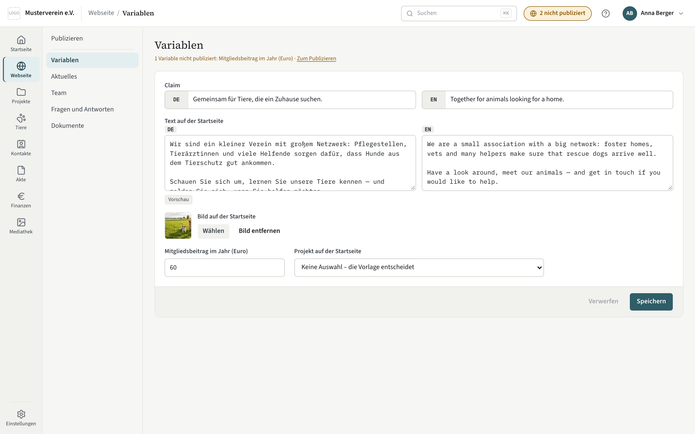

# Variablen

Variablen sind die einzelnen Angaben, die die Vorlage auf der Seite zeigt:
ein Leitspruch, eine Telefonnummer, ein Schalter für ein Angebot, ein Bild
aus der Mediathek. Was es gibt und welchen Typ es hat, bestimmt die Vorlage;
Sie füllen die Werte aus, je Sprache.

## Die Seite

Jede Variable ist ein Feld mit der Beschriftung, die die Vorlage ihr
gegeben hat. Die Reihenfolge ist die der Vorlage. „Speichern“ sichert alle
Felder auf einmal; jede Änderung steht im Änderungsprotokoll. Sind Variablen
geändert, aber noch nicht [publiziert](publizieren.md), nennt eine Zeile über
den Feldern sie, etwa „1 Variable nicht publiziert: Mitgliedsbeitrag im
Jahr (Euro)“, mit dem Link „Zum Publizieren“.

Was Sie **nicht** hier finden: Anschrift, Vorstand, Registereintrag,
Bankverbindung. Die stehen unter [Einstellungen →
Verein](../einstellungen/verein.md) und werden von dort auf die Seite
übernommen — sie stehen nirgends ein zweites Mal.

## Feldtypen

- **Text** — eine Zeile, oft mit einer Höchstlänge, die das Feld anzeigt.
- **Text mit Formatierung** — mehrere Absätze; Überschriften, Listen und
  Hervorhebungen wie beim [Brief](../akte/brief-schreiben.md).
- **Zahl** — mit Unter- und Obergrenze, falls die Vorlage sie setzt.
- **Auswahl** — einer von mehreren festen Werten.
- **Bild oder Datei** — aus der [Mediathek](../mediathek.md). Sie wählen aus
  dem Bestand oder laden von hier aus hoch; die Vorlage bestimmt, welche
  Dateiarten es annimmt.
- **Liste** — mehrere Werte desselben Typs, mit „Hinzufügen“, „Entfernen“
  und einer Höchstzahl.
- **Datum**.
- **Verweis** — ein Datensatz aus einem Modul, etwa das Projekt, das auf der
  Startseite steht. Die Auswahl zeigt nur veröffentlichte Datensätze. „Keine
  Auswahl – die Vorlage entscheidet“ heißt: Die Vorlage nimmt ihren
  eigenen Vorschlag, meist den ersten nach Sortierung.

## Sprachen

Ein Feld, das die Vorlage als mehrsprachig deklariert, hat je eingerichteter
Sprache einen eigenen Wert. Was in einer Sprache fehlt, zeigt „noch nicht
übersetzt“. Die Übersetzungen können Sie hier eintragen — oder Sie lassen sie
sich von einem Assistenten über MCP vorschlagen, der die Lücken kennt
(siehe [Profil](../profil.md)).

## Veraltete Verweise

Wird ein Datensatz, auf den eine Variable verweist, zurückgezogen — das
Projekt ist nicht mehr veröffentlicht —, zeigt das Feld „steht nicht mehr
zur Auswahl“ und den alten Wert. Bis Sie ihn leeren oder neu wählen, liefert
der Export das Feld leer aus, und die Vorlage zeigt ihren Vorschlag. Das
[Publizieren](publizieren.md) meldet solche Verweise als Warnung.
